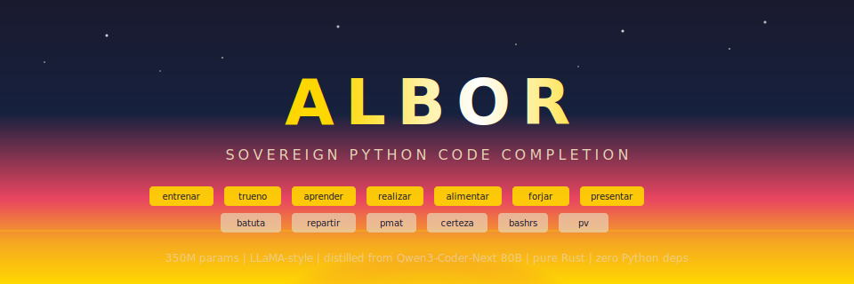

<p align="center">
  
</p>

<p align="center">
  <em>Albor</em> (Spanish: "dawn") — A sovereign Python code completion model trained from first principles using only the Sovereign AI stack.
</p>

<p align="center">
  <a href="https://paiml.github.io/albor/">Specification Book</a> &middot;
  <a href="https://huggingface.co/spaces/bigcode/bigcode-models-leaderboard">Big Code Leaderboard</a> &middot;
  <a href="docs/specifications/albor-llm-spec.md">Full Spec</a>
</p>

---

## What Is Albor?

A **350M-parameter decoder-only transformer** trained entirely in Rust with zero Python dependencies. Python-only following the [phi-1 playbook](https://arxiv.org/abs/2306.11644): maximum concentration on one language, distilled from [Qwen3-Coder-Next](https://huggingface.co/Qwen/Qwen3-Coder-Next) (80B MoE), then optimized through fine-tuning, merging, pruning, and quantization into a fast, local, zero-dependency code completion engine.

**The goal is twofold:**
1. Produce a **usable Python code assist model** that runs anywhere Rust compiles
2. Identify and fix every gap in the [Sovereign AI stack](https://github.com/paiml) that blocks end-to-end LLM development

## Leaderboard Target

[Big Code Models Leaderboard](https://huggingface.co/spaces/bigcode/bigcode-models-leaderboard) — **no sub-1B model has ever appeared on this board.** Albor aims to be the first.

| Model | Params | HumanEval pass@1 | On Leaderboard |
|-------|--------|-------------------|----------------|
| phi-1 | 1.3B | 50.6% | Yes |
| DeciCoder-1B | 1.0B | 19.3% | Yes (smallest) |
| SantaCoder | 1.1B | 18.1% | Yes |
| StarCoderBase-1B | 1.0B | 15.2% | Yes |
| **albor-distill (target)** | **350M** | **>15%** | **Submission target** |
| CodeGen-350M-mono | 350M | 12.8% | No |

## Architecture

```
LLaMA-style decoder-only transformer
├── 24 layers, 1024 hidden dim, 16 attention heads, 4 KV heads (GQA)
├── SwiGLU FFN (4096 intermediate), RoPE, RMSNorm (pre-norm)
├── 32,768 vocab (BPE), 2048 context length
├── ~354M parameters, fits in 4090 VRAM with optimizer state
└── Fill-in-the-middle (FIM) trained for code completion
```

## Improvement Ladder

```
Stage 1: Pre-train base model          → albor-base       (~8% HumanEval)
Stage 2: Distill from Qwen3-Coder-Next → albor-distill    (~13-15%)
Stage 3: Instruction fine-tune (LoRA)  → albor-instruct   (~14-16%)
Stage 4: Merge with complementary model → albor-merged     (~15-17%)
Stage 5: Prune for efficiency          → albor-pruned     (~12-14%)
Stage 6: Quantize for deployment       → albor-q4         (~14-16%, <50ms/tok CPU)
```

## Sovereign AI Stack

Every component is pure Rust. No PyTorch, no Python, no external ML frameworks.

| Component | Role |
|-----------|------|
| [aprender](https://github.com/paiml/aprender) (`apr`) | Unified CLI for all model operations |
| [entrenar](https://github.com/paiml/entrenar) | Training engine, autograd, optimizers, LoRA |
| [trueno](https://github.com/paiml/trueno) | SIMD/GPU tensor backend |
| [realizar](https://github.com/paiml/realizar) | Inference engine (teacher model, eval, serving) |
| [alimentar](https://github.com/paiml/alimentar) | Data pipeline, Parquet I/O, HF Hub import |
| [forjar](https://github.com/paiml/forjar) | Pipeline orchestration (DAG engine, multi-machine) |
| [presentar](https://github.com/paiml/presentar) | Training visualization (TUI + WASM dashboards) |
| [repartir](https://github.com/paiml/repartir) | Distributed compute |
| [batuta](https://github.com/paiml/batuta) | Stack orchestration, falsification |
| [bashrs](https://github.com/paiml/bashrs) | Shell fragment validation |
| [provable-contracts](https://github.com/paiml/provable-contracts) | Design-by-contract verification |
| [pmat](https://github.com/paiml/pmat) | TDG scoring, compliance, fault patterns |
| [certeza](https://github.com/paiml/certeza) | Three-tier test effectiveness |

## Hardware

| Machine | Role | Key Spec |
|---------|------|----------|
| **lambda** | Student training (GPU) | RTX 4090 (24 GB), Threadripper |
| **intel** | Teacher inference, eval, data | 300 GB RAM, Xeon W-3245, 2x W5700X |

## Single Entry Point

```bash
apr pipeline plan configs/pipeline/albor.yaml    # Show full DAG, estimate everything
apr pipeline apply configs/pipeline/albor.yaml   # Execute (resumable, multi-machine)
apr pipeline status                              # What's converged / pending / failed
```

## License

Apache-2.0
