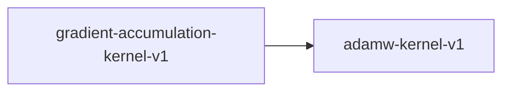

# gradient-accumulation-kernel-v1

**Version:** 1.0.0

Gradient accumulation kernel — numerical equivalence of micro-batch accumulation

## References

- Goyal et al. (2017) Accurate, Large Minibatch SGD: Training ImageNet in 1 Hour

## Dependencies

- [adamw-kernel-v1](adamw-kernel-v1.md)

## Dependency Graph

## Equations

### accumulation

$$
G_accum = (1/N) * sum_{i=1}^{N} g_i
$$

**Domain:** $g_i: gradient from micro-batch i, N: accumulation steps$

**Codomain:** $G_accum: accumulated gradient tensor$

**Invariants:**

- $G_accum approximates G_full within fp tolerance$
- $N=1 => G_accum = g_1 exactly$

### loss_scaling

$$
L_scaled = (1/N) * L_micro
$$

**Domain:** $L_micro: micro-batch loss, N: accumulation steps$

**Codomain:** $L_scaled: scaled loss for backward pass$

**Invariants:**

- $Total loss = mean of micro-batch losses (not sum)$
- $Gradients are correctly scaled by 1/N$

## Proof Obligations

| # | Type | Property | Formal |
|---|------|----------|--------|
| 1 | equivalence | Numerical equivalence | $\|\|G_accum - G_full\|\| < epsilon (1e-5 fp32, 1e-3 fp16)$ |
| 2 | invariant | Loss scaling correctness | $Total loss = mean(micro_batch_losses)$ |
| 3 | invariant | Gradient zeroing between cycles | $No stale gradients from previous accumulation cycle$ |
| 4 | invariant | Optimizer step frequency | $optimizer.step() called once per N micro-batches$ |
| 5 | invariant | Mixed precision accumulation in fp32 | $Accumulation buffer dtype is fp32 even when forward uses fp16$ |
| 6 | invariant | Gradient clipping after accumulation | $Clipping applied to accumulated gradient, not per micro-batch$ |

## Kernel Phases

1. **zero_gradients**: Zero gradient buffers at start of accumulation cycle — *all gradient values are 0.0*
2. **accumulate**: Add scaled micro-batch gradients: G += (1/N) * g_i — *accumulation buffer is fp32*
3. **clip**: Apply gradient clipping to accumulated gradient — *||G_clipped|| <= max_norm*
4. **step**: Optimizer updates parameters using accumulated gradient — *called exactly once per N micro-batches*

## Falsification Tests

| ID | Rule | Prediction | If Fails |
|----|------|------------|----------|
| FALSIFY-GA-001 | Numerical equivalence | Accumulated gradient matches full-batch gradient within tolerance | Scaling factor (1/N) not applied, or accumulation buffer wrong dtype |
| FALSIFY-GA-002 | Gradient zeroing | No gradient leakage between accumulation cycles | Gradient buffers not zeroed before new cycle |
| FALSIFY-GA-003 | Step count | Exactly 3 optimizer steps for 3N micro-batches | Step called per micro-batch instead of per cycle |
| FALSIFY-GA-004 | Clip after accumulate | One large micro-batch gradient triggers clipping once on total | Clipping applied per micro-batch instead of on accumulated total |

## Kani Harnesses

| ID | Obligation | Bound | Strategy |
|----|------------|-------|----------|
| KANI-GA-001 | GA-EQ-001 | 4 | stub_float |
| KANI-GA-002 | GA-INV-001 | 8 | exhaustive |

## QA Gate

**Gradient Accumulation Contract** (F-GA-001)

Gradient accumulation correctness for Albor training

**Checks:** numerical_equivalence, gradient_zeroing, step_count, clip_after_accumulate

**Pass criteria:** All 4 falsification tests pass + 2 Kani harnesses verify

