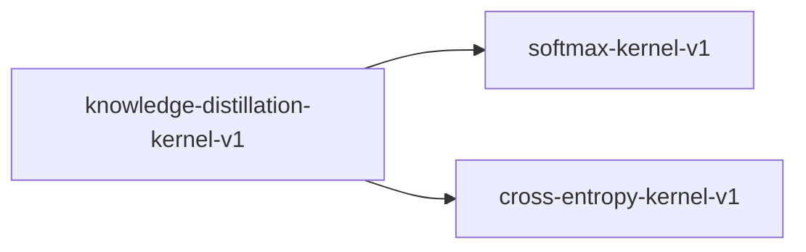

# knowledge-distillation-kernel-v1

**Version:** 1.0.0

Knowledge distillation kernel — temperature-scaled KL divergence + cross-entropy

## References

- Hinton et al. (2015) Distilling the Knowledge in a Neural Network
- Ba & Caruana (2014) Do Deep Nets Really Need to be Deep?

## Dependencies

- [softmax-kernel-v1](softmax-kernel-v1.md)
- [cross-entropy-kernel-v1](cross-entropy-kernel-v1.md)

## Dependency Graph

## Equations

### kd_loss

$$
L_KD = alpha * KL(softmax(z_t/T) || softmax(z_s/T)) * T^2 + (1-alpha) * CE(y, z_s)
$$

**Domain:** $z_t, z_s in R^V, T > 0, alpha in [0,1]$

**Codomain:** $L_KD in [0, +inf)$

**Invariants:**

- $L_KD >= 0 (non-negativity from KL and CE non-negativity)$
- $alpha=0 => L_KD = CE(y, z_s) (pure hard label)$
- $alpha=1 => L_KD = T^2 * KL(teacher || student) (pure soft label)$

### kl_divergence

$$
KL(P || Q) = sum_i P(i) * \log(P(i) / Q(i))
$$

**Domain:** $P, Q valid probability distributions over V classes$

**Codomain:** $KL in [0, +inf)$

**Invariants:**

- $KL(P || Q) >= 0 (Gibbs inequality)$
- $KL(P || P) = 0 (identity)$

### temperature_softmax

$$
softmax(z/T)_i = \exp(z_i/T) / sum_j \exp(z_j/T)
$$

**Domain:** $z in R^V, T > 0$

**Codomain:** $softmax in (0, 1)^V, sum = 1$

**Invariants:**

- $All outputs strictly positive$
- $Outputs sum to 1$
- $T -> inf => uniform distribution$
- $T -> 0 => one-hot on argmax$

## Proof Obligations

| # | Type | Property | Formal |
|---|------|----------|--------|
| 1 | invariant | KL non-negativity | $KL(P \|\| Q) >= 0 for all valid P, Q$ |
| 2 | bound | Temperature scaling produces valid distribution | $softmax(z/T)_i > 0 and sum_i softmax(z/T)_i = 1 for T > 0$ |
| 3 | invariant | Alpha interpolation bound | $alpha=0 => L_KD = CE; alpha=1 => L_KD = T^2 * KL$ |
| 4 | equivalence | Gradient correctness | $analytical gradient matches numerical gradient within 1e-4$ |
| 5 | invariant | T^2 gradient compensation | $gradient magnitude approximately constant across T in [1, 10]$ |
| 6 | equivalence | SIMD matches scalar within ULP |  |

## Kernel Phases

1. **teacher_softmax**: Compute softmax(z_t / T) — teacher soft targets — *output is valid probability distribution*
2. **student_softmax**: Compute softmax(z_s / T) — student soft predictions — *output is valid probability distribution*
3. **kl_divergence**: Compute KL(teacher || student) — *result >= 0*
4. **cross_entropy**: Compute CE(y, z_s) — hard label loss — *result >= 0*
5. **combine**: Combine: alpha * T^2 * KL + (1-alpha) * CE — *result >= 0*

## Falsification Tests

| ID | Rule | Prediction | If Fails |
|----|------|------------|----------|
| FALSIFY-KD-001 | KL non-negativity | KL(teacher \|\| student) >= 0 for all batches | Log-domain computation error or softmax numerical instability |
| FALSIFY-KD-002 | Temperature boundary | softmax(z/T) approaches uniform as T -> inf | Overflow in exp(z/T) for small T or large z |
| FALSIFY-KD-003 | Alpha boundary conditions | alpha=0 => KD loss equals CE loss exactly | Alpha interpolation not applied correctly |
| FALSIFY-KD-004 | Gradient correctness | Analytical gradient matches finite-difference within 1e-4 | Derivative of KL or CE computed incorrectly |
| FALSIFY-KD-005 | Distillation value | albor-distill avg benchmark > albor-base avg benchmark | Teacher logits corrupted, T too high/low, or alpha miscalibrated |

## Kani Harnesses

| ID | Obligation | Bound | Strategy |
|----|------------|-------|----------|
| KANI-KD-001 | KD-INV-001 | 8 | stub_float |
| KANI-KD-002 | KD-INV-002 | 8 | stub_float |

## QA Gate

**Knowledge Distillation Contract** (F-KD-001)

KD loss correctness for Albor distillation pipeline

**Checks:** kl_non_negativity, temperature_validity, alpha_interpolation, gradient_correctness

**Pass criteria:** All 5 falsification tests pass + 2 Kani harnesses verify

