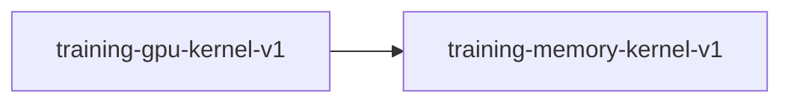

# training-gpu-kernel-v1

**Version:** 1.0.0

GPU-resident pretraining kernel — CudaTransformerBlock wired into TransformerTrainer

## References

- classify_pipeline.rs GPU training pattern (ENT-151, ENT-152)
- training-memory-kernel-v1.yaml (VRAM estimation)

## Dependencies

- [training-memory-kernel-v1](training-memory-kernel-v1.md)

## Dependency Graph

## Equations

### gpu_utilization

$$
util = compute_time / (compute_time + transfer_time + sync_time)

$$

**Domain:** $Measured via nvidia-smi dmon or CUDA events$

**Codomain:** $GPU utilization ratio [0, 1]$

**Invariants:**

- $util > 0.70 for models >= 350M params with batch_size >= 4$
- $Previous CPU autograd achieved ~0.07 (7\%) due to 16K transfers/step$

### pcie_transfers_per_step

$$
T = 3 (constant)
Transfer 1 (H2D): hidden = S × H × 4 bytes
Transfer 2 (D2H): logits = S × V × 4 bytes
Transfer 3 (H2D): grad_logits = S × V × 4 bytes
Total bytes per step = S × (H + 2V) × 4

$$

**Domain:** $S: seq_len, H: hidden_size, V: vocab_size
$

**Codomain:** $T = 3: exactly 3 PCIe transfers per training step$

**Invariants:**

- $Embedding lookup stays on CPU (scatter-gather, not matmul)$
- $Cross-entropy loss + softmax backward stays on CPU$
- $All transformer block forward/backward/optimizer on GPU$
- $RMSNorm forward/backward on GPU$
- $LM head GEMM forward/backward on GPU$

### transfer_overhead

$$
overhead_ms = total_bytes / bandwidth
For PCIe 4.0 x16: bandwidth = 32 GB/s
For 350M model (H=1024, V=32K, S=2048):
  total = 2048 × (1024 + 2×32768) × 4 = 544 MB
  overhead = 544 MB / 32 GB/s = 17 ms

$$

**Domain:** $Architecture params + PCIe bandwidth$

**Codomain:** $Transfer overhead in milliseconds (theoretical)$

**Invariants:**

- $Transfer overhead < 5\% of compute time for models >= 350M params$
- $GPU compute time dominates for large models$

## Proof Obligations

| # | Type | Property | Formal |
|---|------|----------|--------|
| 1 | equivalence | GPU training loss matches CPU training loss | $\|loss_gpu(step=N) - loss_cpu(step=N)\| < epsilon for all N in [1, 100]$ |
| 2 | invariant | Exactly 3 PCIe transfers per step | $count(H2D) + count(D2H) = 3 per train_step_single() call$ |
| 3 | bound | GPU utilization exceeds 70% | $gpu_util >= 0.70 during training (measured over 100+ steps)$ |
| 4 | invariant | Weight sync preserves values | $sync_weights_to_cpu() => \|w_cpu[i] - w_gpu[i]\| == 0 for all i$ |
| 5 | invariant | Graceful fallback on CUDA failure | $CudaTransformerTrainer::new() Err => TransformerTrainer used instead$ |

## Falsification Tests

| ID | Rule | Prediction | If Fails |
|----|------|------------|----------|
| FALSIFY-GPU-001 | GPU and CPU training produce equivalent loss | After 10 steps with identical init, \|loss_gpu - loss_cpu\| < 1e-3 | Numerical divergence in GPU kernels or incorrect gradient flow |
| FALSIFY-GPU-002 | Saved weights differ from init after GPU training | model.safetensors weights != init weights after 10+ steps | Weight sync broken or optimizer not updating GPU weights |
| FALSIFY-GPU-003 | Fallback works when CUDA unavailable | train_from_yaml succeeds with use_cuda=true but no GPU | Fallback path broken or non-CUDA stub missing |
| FALSIFY-GPU-004 | GPU utilization > 70% for 350M model | nvidia-smi dmon shows >70% GPU utilization during training | Unexpected PCIe bottleneck, kernel launch overhead, or memory contention |

## QA Gate

**GPU-Resident Pretraining Contract** (F-GPU-001)

CudaTransformerTrainer correctness and efficiency

**Checks:** numerical_equivalence, transfer_count_invariant, gpu_utilization_bound, weight_sync_exact, graceful_fallback

**Pass criteria:** All 4 falsification tests pass

