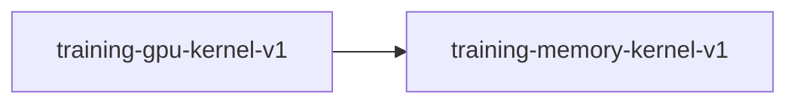

# training-memory-kernel-v1

**Version:** 1.0.0

Training memory estimation kernel — closed-form VRAM projection from architecture

## References

- Korthikanti et al. (2022) Reducing Activation Recomputation in Large Transformer Models
- Rajbhandari et al. (2020) ZeRO: Memory Optimizations Toward Training Trillion Parameter Models

## Dependency Graph

## Equations

### activation_memory

$$
M_act = L × S × H × K × 4
K = 10 (Q, K, V, attn_scores, attn_out, gate, up, down, 2×residual)

$$

**Domain:** $L: num_layers, S: seq_len, H: hidden_size,
K: activation tensor count per layer (upper bound),
4: bytes per f32 element
$

**Codomain:** $M_act: peak activation memory in bytes (upper bound)$

**Invariants:**

- $entrenar processes batch items sequentially — activation memory is per single sequence$
- $K=10 is conservative upper bound; actual depends on tensor lifetime overlap$
- $Gradient checkpointing reduces M_act to O(\sqrt{L}) but is not default$

### gradient_memory

$$
M_grad = P_total × 4
$$

**Domain:** $P_total: parameter count$

**Codomain:** $M_grad: gradient memory in bytes (exact)$

**Invariants:**

- $Gradients always f32 regardless of mixed precision mode$
- $One gradient tensor per parameter$

### optimizer_memory

$$
M_opt = P_total × 8
$$

**Domain:** $P_total: parameter count$

**Codomain:** $M_opt: AdamW optimizer state memory in bytes (exact)$

**Invariants:**

- $AdamW stores first moment (m) and second moment (v), both f32$
- $M_opt = P × 4 (m) + P × 4 (v) = P × 8$

### parameter_count

$$
P_embed = V × H
P_layer = 2H + H² + H×D_kv + H×D_kv + H² + H×I + H×I + I×H
       = 2H + 2H² + 2H×D_kv + 3H×I
P_norm  = H
P_total = P_embed + L × P_layer + P_norm

$$

**Domain:** $V: vocab_size, H: hidden_size, L: num_hidden_layers,
D_kv: num_kv_heads × head_dim, I: intermediate_size,
head_dim: H / num_attention_heads
$

**Codomain:** $P_total: total trainable parameter count (exact)$

**Invariants:**

- $P_total is deterministic given architecture — no randomness$
- $P_embed dominates for large vocab; P_layer dominates for deep models$

### total_memory

$$
M_total = M_weights + M_grad + M_opt + M_act + M_cuda
$$

**Domain:** $M_cuda \approx 512 MB (CUDA context, cuBLAS workspace, allocator overhead)$

**Codomain:** $M_total: total estimated memory in bytes$

**Invariants:**

- $M_total is an upper bound — actual usage may be lower due to tensor reuse$
- $Does not include KV cache (inference only, not training)$
- $entrenar hybrid mode: weights/grads/optimizer live in CPU RAM; only matmul operands transfer to GPU$
- $In hybrid mode, VRAM \approx M_cuda + max(matmul_operand_pair); CPU RAM \approx M_weights + M_grad + M_opt + M_act$
- $M_total represents peak system memory (CPU+GPU) needed, not VRAM alone$

### weight_memory

$$
M_weights = P_total × B_w
$$

**Domain:** $P_total: parameter count, B_w: bytes per weight (4 for f32, 2 for fp16/bf16)$

**Codomain:** $M_weights: weight memory in bytes (exact)$

**Invariants:**

- $Mixed precision stores master weights in f32 + fp16 copy: M_weights = P × (4 + 2)$
- $entrenar current impl: always f32 storage, fp16 cast at matmul site$

## Proof Obligations

| # | Type | Property | Formal |
|---|------|----------|--------|
| 1 | equivalence | Parameter count is exact | $P_total = P_embed + L × P_layer + P_norm for LLaMA architecture$ |
| 2 | equivalence | Weight memory is exact | $M_weights = P_total × sizeof(dtype)$ |
| 3 | equivalence | Gradient memory is exact | $M_grad = P_total × 4 (always f32)$ |
| 4 | equivalence | Optimizer memory is exact for AdamW | $M_opt = P_total × 8 (two f32 state tensors)$ |
| 5 | bound | Activation memory is upper bound | $M_act_actual <= L × S × H × K × 4$ |

## Falsification Tests

| ID | Rule | Prediction | If Fails |
|----|------|------------|----------|
| FALSIFY-MEM-001 | Parameter count matches model | P_total from formula equals Transformer::parameters().len() sum of element counts | Architecture equation wrong or model has extra parameters |
| FALSIFY-MEM-002 | Activation upper bound holds | Peak RSS during forward pass <= M_act formula | K factor too low, or hidden intermediate tensors not counted |
| FALSIFY-MEM-003 | Total estimate covers actual GPU usage | nvidia-smi peak memory <= M_total | Missing memory component or CUDA overhead underestimated |

## Kani Harnesses

| ID | Obligation | Bound | Strategy |
|----|------------|-------|----------|
| KANI-MEM-001 | MEM-EXACT-001 | 4 | exhaustive |

## QA Gate

**Training Memory Estimation Contract** (F-MEM-001)

VRAM estimation correctness for apr train plan

**Checks:** parameter_count_exact, activation_upper_bound, total_covers_actual

**Pass criteria:** All 3 falsification tests pass

